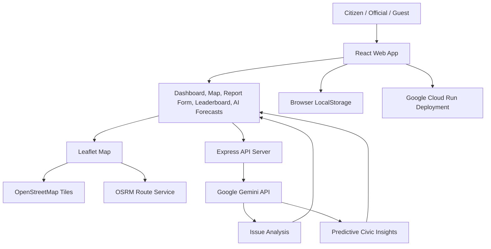

# Civic Connect

Civic Connect is a local civic issue reporting app. It helps residents report neighborhood problems like potholes, water leaks, broken streetlights, waste issues, and damaged public infrastructure.

The app also gives city officials a simple way to review reports, start work, and mark issues as resolved.

## Live App

Deployment URL: https://community-hero-1012287889927.asia-southeast1.run.app

## What You Can Do

- Report a civic issue with a title, description, category, priority, image, and map location.
- Use Gemini AI to help fill issue details, category, priority, tags, and safety advice.
- View all incidents on an interactive map.
- Click an incident to focus the map on that location.
- Use "Show route" to see the route to an incident.
- Verify or dispute reports as a citizen.
- Add comments to incident discussions.
- Earn XP and badges for reporting and verifying issues.
- View citizen ranking in the leaderboard.
- See category breakdown, civic pipeline status, and neighborhood hotspots.
- Let officials move issues from reported/verified to in progress and resolved.
- View AI-generated civic forecasts and risk insights.

## User Roles

### Citizen

Citizens can:

- Register or log in.
- Raise new civic incidents.
- Use AI assistance while reporting.
- Pick an issue location from the map.
- Verify, dispute, upvote, and comment on incidents.
- Earn XP and appear on the leaderboard.

### Official

Officials can:

- Register or log in as an official.
- Review active civic incidents.
- Start work by adding a work ID and ETA.
- Resolve issues by adding resolution notes.
- Help keep the civic pipeline updated.

### Guest

Guests can explore the app, but they need to log in or register before reporting, verifying, or earning XP.

## Screenshots and Flow Document

A detailed walkthrough with screenshots is available here:

[Civic Connect Application Flows & Screenshots](https://docs.google.com/document/d/1xS9BRStbke_qViUthact9ITR8-UuM4Uy7pRGLFtwW58/edit?tab=t.0)

## Tech Stack

- React
- TypeScript
- Vite
- Tailwind CSS
- Express
- Leaflet and React Leaflet
- Google Gemini API via `@google/genai`
- LocalStorage for demo app state

## Application Architecture



### How The Pieces Work Together

- The React app runs in the browser and shows the dashboard, map, forms, leaderboard, and AI forecast screens.
- LocalStorage keeps demo users, reports, XP, comments, and incident status on the browser.
- Leaflet displays the map using OpenStreetMap tiles.
- OSRM provides route data for the "Show route" feature.
- The Express server handles backend API requests.
- Gemini helps analyze reports and generate predictive civic insights.
- The deployed app runs on Google Cloud Run.

## Google Technologies Used

- Google Gemini for AI issue analysis.
- Gemini structured JSON output for reliable app data.
- Gemini-powered predictive civic insights.
- Google Cloud Run for deployment.

## Run Locally

1. Install dependencies:

   ```bash
   npm install
   ```

2. Create a `.env` file from `.env.example`.

3. Add your Gemini API key:

   ```bash
   GEMINI_API_KEY="your_api_key_here"
   ```

4. Start the development server:

   ```bash
   npm run dev
   ```

5. Open the app:

   ```text
   http://localhost:3000
   ```

## Build for Production

```bash
npm run build
```

Start the production server:

```bash
npm start
```

## Demo Accounts

You can use these built-in accounts for quick testing.

### Citizens

```text
Email: alex@example.com
Password: password123
```

```text
Email: elena@example.com
Password: password123
```

### City Official

```text
Email: admin@city.gov
Password: adminpassword
```

Official registration uses a 6-digit Official ID PIN, for example:

```text
123456
```

## Main App Flow

1. Open the dashboard to view current civic issues.
2. Use filters to narrow incidents by category or status.
3. Click a hotspot, map pin, or incident card to inspect details.
4. Log in or register as a citizen to report an issue.
5. Add issue details, select a location, and submit the report.
6. Other citizens can verify, dispute, upvote, or comment.
7. Officials can start work by adding a work ID and ETA.
8. Officials can resolve the issue with completion notes.
9. Citizens can track progress through the map, incident list, leaderboard, and dashboard charts.

## Environment Variables

Common variables:

```bash
GEMINI_API_KEY="your_gemini_api_key"
APP_URL="https://community-hero-1012287889927.asia-southeast1.run.app"
```

For local development, `APP_URL` can be:

```bash
APP_URL="http://localhost:3000"
```
